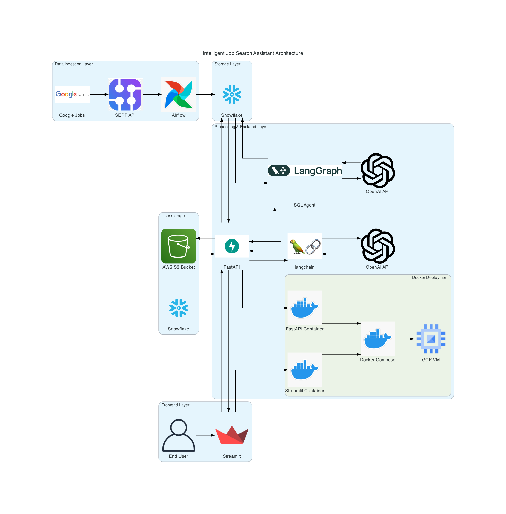
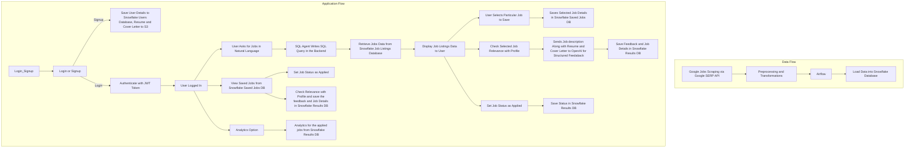

# Intelligent Job Search Assistant

[](https://airflow.apache.org/)
[](https://streamlit.io)
[](https://fastapi.tiangolo.com/)
[](https://python.org)
[](https://www.snowflake.com/)

[](https://openai.com)
[](https://github.com/langchain-ai/langchain)
[](https://github.com/langchain-ai/langgraph)

[](https://github.com/)
[](https://github.com/features/actions)
[](https://www.docker.com/)


---

WE ATTEST THAT WE HAVEN’T USED ANY OTHER STUDENTS’ WORK IN OUR
PROJECT AND ABIDE BY THE POLICIES LISTED IN THE STUDENT HANDBOOK
Contribution:
- Viswanath Raju Indukuri: 33.3%
- Snehal Shivaji Molavade: 33.3%
- Sai Vivekanand Reddy Vangala: 33.3%

---

## Links
1. **Application URL**: http://viswanath.me:8501/
2. **Backend Service Link**: http://viswanath.me:8000/docs
3. **Final Codelabs Report**: [View Report](https://codelabs-preview.appspot.com/?file_id=1M37nENvgtKTGsCYfi8TnebYeSrfNwSMdzXxU_mIjOBg#0)
4. **Application Demo**: [Watch Video](https://drive.google.com/drive/folders/1jAFPlM8YFPhveZ6IiSmsVj5E1-U6Bg3H?usp=sharing)
5. **Proposal Codelabs Report**: [View Report](https://codelabs-preview.appspot.com/?file_id=1JGeUAieHgwrS8Kxsetu1_HHAeJsj8REv8EMC-kxBqW0#0)
6. **Proposal Video**: [Watch Video](https://drive.google.com/drive/folders/1DHzRlApDj-2Uo6RVT5viC4lYyjXmdB3s?usp=sharing)

---
# Introduction

Navigating the competitive job market can be overwhelming, with candidates often struggling to identify relevant opportunities and optimize their application materials for specific roles. Traditional job boards provide limited options, while tailoring resumes and cover letters for individual job descriptions is time-consuming and subjective. This project introduces an intelligent system that expands job searches across multiple sources and provides actionable insights to improve profile optimization, enhancing job-seeking efficiency and success rates.

The **Intelligent Job Search Assistant** aims to simplify and enhance the job application process by offering:

- Access to the latest job opportunities aggregated from multiple sources via the Google SERP API.
- Real-time feedback on the relevance of selected jobs to the user's resume and cover letter.
- Actionable suggestions to tailor application materials for specific roles, increasing the chances of getting shortlisted.

---

# Project Overview

The **Intelligent Job Search Assistant** provides a comprehensive suite of features to support users throughout their job search journey:

1. **Job Data Collection**: Aggregates job listings from multiple sources using Google SERP API and stores them in Snowflake.
2. **User Management**: Facilitates user sign-up, login, and profile management, including resume and cover letter uploads.
3. **Job Search and Filtering**: Allows users to search for jobs by role and view detailed job information.
4. **Application Assistance**: Uses AI to provide feedback on resume and cover letter relevance to specific job descriptions.
5. **Job Tracking**: Enables users to save jobs, track application statuses, and mark applications as submitted.
6. **Analytics**: Offers insights into the user's job search process through descriptive statistics and visualizations.

---

# Architecture

The project leverages a multi-layered architecture with the following technologies:
- **Backend**: FastAPI for handling APIs and integrating with LLMs.
- **Frontend**: Streamlit for user interaction and visualizations.
- **Database**: Snowflake for storing user and job data.
- **Storage**: AWS S3 for managing uploaded files (resumes and cover letters).
- **Data Scraping**: Google SERP API for fetching job listings.
- **Analytics**: Descriptive and visual insights using integrated modules.
- **Deployment**: Dockerized application with CI/CD via GitHub Actions and hosting on GCloud VM.

  

---

# Data and Application Workflow



---

# Methodology

### Data Sources
1. **Job Listings**:
   - **Source**: Google SERP API for aggregating jobs from company websites, job boards, and niche platforms.
   - **Data Collected**: Job title, company name, location, job description, posted date, and application links (stored in the `joblistings` table in Snowflake).

2. **User-Provided Data**:
   - **Resumes and Cover Letters**: Stored in AWS S3 in PDF format.
   - **User Details**: Stored in Snowflake (`user` table), including name, email, and interaction data.

3. **Application Management Data**:
   - **User Interactions**: Data on saved and applied jobs is stored in Snowflake.

### Technologies & Tools
- **Data Collection and API Gateway**:
  - **FastAPI**: Handles application requests, user interactions, and integration with LangGraph, Snowflake, and S3.
- **Data Storage**:
  - **Snowflake**: For structured job and user data storage.
  - **AWS S3**: For storing user-uploaded files (resumes and cover letters).
- **Data Processing and Analysis**:
  - **OpenAI & LangChain**: Evaluates the relevance of resumes and cover letters to job descriptions, providing feedback and scores.
  - **LangGraph**: Facilitates SQL-based querying of Snowflake data using natural language.
- **Orchestration**:
  - **Airflow**: Manages data ingestion, processing, and storage tasks.
- **Frontend and Visualization**:
  - **Streamlit**: Provides an interactive user interface for job search, application management, and analytics visualization.
- **Infrastructure and Deployment**:
  - **Docker**: For containerization of application components.
  - **Google Cloud VMs**: For scalable deployment of the application.

### Data Pipeline Design
1. **Data Ingestion**:
   - Scheduled scraping of job data via Google SERP API and ingestion into Snowflake.
   - Resumes and cover letters uploaded by users are stored in AWS S3.
2. **Data Cleaning and Transformation**:
   - **Job Listings**: Deduplication, completeness checks, and standardization of fields (e.g., job titles, locations).
   - **User Data**: Ensures compatibility (e.g., PDF format) and extracts text for analysis.
3. **Data Processing and Analysis**:
   - **Relevance Scoring**: Compares job descriptions against resumes and cover letters using OpenAI and LangChain, generating relevance scores and improvement feedback.
   - **SQL Query Translation**: Translates natural language job search queries into SQL for Snowflake using LangGraph.
4. **Application Tracking**:
   - Saves user interactions and application statuses in Snowflake.
5. **Analytics and Visualization**:
   - Provides descriptive insights such as success rates, application trends, and most-applied roles.

---

# Outcomes and Benefits

### Outcomes
- **Job Aggregation**: Aggregate and display job listings from multiple sources, ensuring relevance based on user queries.
- **Profile Optimization**: Provide actionable feedback for resumes and cover letters for all user-selected jobs.
- **User Engagement**: Enable users to save and track job applications with accurate data retention.
- **Analytics**: Generate insights into application trends, success rates, and frequently applied roles.
- **System Performance**:
  - Maintain response times under 2 seconds for job searches and relevance scoring.
  - Ensure 99% system uptime and availability.

### Benefits
1. **Enhanced Job Search Experience**:
   - Broader access to job opportunities from diverse sources.
2. **Improved Application Success Rates**:
   - Tailored feedback for stronger applications increases the chances of getting shortlisted.
3. **Streamlined Application Management**:
   - Simplifies workflows for tracking and managing job applications.
4. **Interview Preparation Support**:
   - Retains job details to help users prepare effectively for interviews.
5. **Data-Driven Decision Making**:
   - Empowers users with analytics to refine job search strategies.
6. **User Satisfaction**:
   - Comprehensive features create a seamless experience, boosting satisfaction and retention.

---

# Project Tree
```
├── Airflow
│   ├── config
│   ├── dags
│   │   ├── jobs_data_dag.py
│   │   ├── multijob_transformed.py
│   │   └── upload_table.py
│   ├── docker-compose.yaml
│   ├── dockerfile
│   ├── poetry.lock
│   └── pyproject.toml
├── FastAPI_Services
│   ├── Dockerfile
│   └── main.py
├── LICENSE
├── PoC
│   ├── DataAcq_PoC.ipynb
│   ├── jobserp.py
│   ├── jobserp_multijob.py
│   ├── jobserp_multijob_dated.py
│   ├── software_engineer_jobs.csv
│   ├── software_engineer_jobs.json
│   ├── sql_agent.ipynb
│   ├── sql_agent_poc.ipynb
│   ├── tech_jobs.csv
│   └── tech_jobs.json
├── README.md
├── Streamlit_UI_App
│   ├── Dockerfile
│   ├── Home.py
│   ├── pages
│   │   ├── 1_🔑Login_Signup.py
│   │   ├── 2_🔍 Intelligent_Job_Search.py
│   │   ├── 3_📂Saved_Jobs.py
│   │   ├── 4_📄Application_Materials.py
│   │   ├── 5_📊User_Analytics.py
│   │   └── 6_📋Job_Listings_Analytics.py
│   └── utils.py
├── diagrams
│   ├── Agents_diag.py
│   ├── Final_proj_diag.py
│   ├── airflow_icon.png
│   ├── arxiv_icon.png
│   ├── cfa_icon.png
│   ├── docker_icon.png
│   ├── docling_ico.png
│   ├── docling_icon.png
│   ├── fastapi_icon.png
│   ├── google_jobs_icon.png
│   ├── google_search_icon.jpg
│   ├── intelligent_job_search_assistant_architecture.png
│   ├── job_assistant_architecture.png
│   ├── langgraph_icon.png
│   ├── openai_icon.png
│   ├── pinecone_icon.png
│   ├── rag_icon.png
│   ├── selenium_icon.png
│   ├── serp_icon.png
│   ├── snowflake_icon.png
│   ├── streamlit_icon.png
│   └── updated_research_assistant_system.png
├── docker-compose.yml
├── poetry.lock
├── project-tree.txt
├── pyproject.toml
└── tests
    ├── __init__.py
    ├── pytest.ini
    ├── test_integration.py
    └── test_unit.py
```

---
# Instructions for Setting Up the Data Pipeline and Application Services Locally

## Prerequisites
Ensure the following tools are installed:
- **Python 3.12.7**
- **Poetry** for dependency management
- **Docker** and **Docker Compose** or the **Docker** desktop app for containerization

## Required Environment Variables
Create a `.env` file in the root directory and populate it with the following keys:

```plaintext
# OpenAI API Key
OPENAI_API_KEY=<your_openai_api_key>

# SERP API Key
SERP_API_KEY=<your_serp_api_key>

# Snowflake Database Configuration
SNOWFLAKE_ACCOUNT=<your_snowflake_account>
SNOWFLAKE_USER=<your_snowflake_user>
SNOWFLAKE_PASSWORD=<your_snowflake_password>
SNOWFLAKE_JOBSDB=<your_jobs_database>
SNOWFLAKE_USER_PROFILES_DB=<your_user_profiles_database>
SNOWFLAKE_USER_RESULTS_DB=<your_user_results_database>
SNOWFLAKE_SCHEMA=<your_snowflake_schema>
SNOWFLAKE_WAREHOUSE=<your_snowflake_warehouse>

# AWS S3 Configuration
AWS_ACCESS_KEY_ID=<your_aws_access_key>
AWS_SECRET_ACCESS_KEY=<your_aws_secret_access_key>
AWS_REGION=<your_aws_region>
AWS_S3_BUCKET_NAME=<your_s3_bucket_name>

# JWT Authentication
SECRET_KEY=<secret_key_for_jwt>
ALGORITHM=<alogorithm_type>
ACCESS_TOKEN_EXPIRE_MINUTES=<time>
```

---

## Setting Up and Running Airflow
Navigate to the Airflow directory:
```
cd Airflow
```
Initialize Poetry
```
poetry init
poetry shell
``````
Intall dependencies
```
poetry install
```
Build and start Docker containers for Airflow:
```
docker compose build --no-cache
docker compose up
```
---

## Running Streamlit and FastAPI Services Locally

Initialize Poetry
```
poetry init
poetry shell
``````
Intall dependencies
```
poetry install
```
Run the Streamlit application
```
streamlit run Streamlit_UI_App/Home.py
```
Run the FastAPI backend
```
uvicorn FastAPI_Services.main:app --reload
```

---

##  Running Streamlit and FastAPI Services Using Docker Containers Locally
From the root directory, build and start the Docker containers
```
docker compose build --no-cache
docker compose up
```
---
